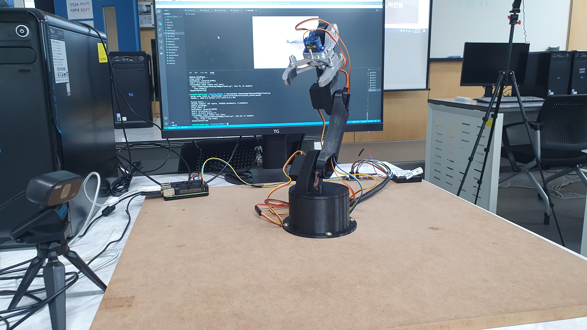

# object_detection_robot

> A robotic arm prototype for object detection, HSV-based sorting, and dataset-driven vision control on Raspberry Pi.


## Overview
object_detection_robot은 객체 인식 결과를 바탕으로 로봇 팔을 제어하는 프로토타입입니다. 색상 기반 HSV 분류와 YOLOv5 기반 객체 인식 실험을 함께 진행했고, 데이터 수집, 증강, 라벨링, 로직도 설계까지 직접 연결했습니다. 라즈베리파이와 PCA9685 서보모터 드라이버를 사용해 비전 모델 결과를 실제 동작으로 이어지도록 구성했습니다.

## Project Context
| Item | Details |
| --- | --- |
| Context | Daelim University project |
| Period | 2023.03 ~ 2023.07 |
| Goal | 객체 인식 기반 로봇 팔 제어와 분류 자동화 |
| Scope | 데이터 수집, 증강, 라벨링, 객체 인식 모델 적용, 로봇 팔 제어 |

## My Role
- 로봇 동작 제어와 객체 인식 파이프라인 구현을 담당했습니다.
- 객체 인식 모델을 구축하고 학습해 로봇 팔 분류 흐름에 적용했습니다.
- 데이터 수집 후 증강 기법을 적용해 약 2,200장의 학습용 이미지를 구성했습니다.
- 라벨링과 로직도 설계를 포함해 모델 실험과 하드웨어 동작을 연결했습니다.

## Tech Stack
`Python`, `PyTorch`, `YOLOv5`, `OpenCV`, `Raspberry Pi`, `Adafruit PCA9685`, `SolidWorks`, `3D Printing`

## Key Contributions
- HSV 기반 분류 실험과 YOLOv5 커스텀 모델 테스트 코드 구성
- 로봇 팔 위치 제어를 위한 서보모터 각도 로직 구현
- 데이터 증강과 BBox 라벨링을 포함한 학습 데이터셋 준비
- 객체 인식 결과를 실제 분류 동작으로 연결하는 시스템 로직도 작성

## Implementation Notes
- `use_hsv.py`: HSV 기반 색상 분류와 로봇 팔 제어 실험
- `custom_model_test.py`: 커스텀 YOLOv5 모델 추론 테스트
- `robot_arm.py`: 객체 인식 결과에 따른 서보모터 제어 로직
- 로봇 팔은 SolidWorks 모델링 후 3D 프린팅 부품으로 제작했습니다.

## Project Gallery
### Prototype View


### Dataset Preparation


### System Logic


<details>
<summary>Team</summary>

| Name | Role |
| --- | --- |
| 이성욱 | 로봇 동작 제어 및 객체 인식 개발 |
| 이용진 | 로봇 동작 제어 및 객체 인식 개발 |
| 이경현 | 하드웨어 제작 및 모델링 |

</details>

<details>
<summary>Setup Notes</summary>

```bash
sudo apt-get install git build-essential python-dev
git clone https://github.com/adafruit/Adafruit_Python_PCA9685.git
cd Adafruit_Python_PCA9685
sudo python3 setup.py install
```

</details>
